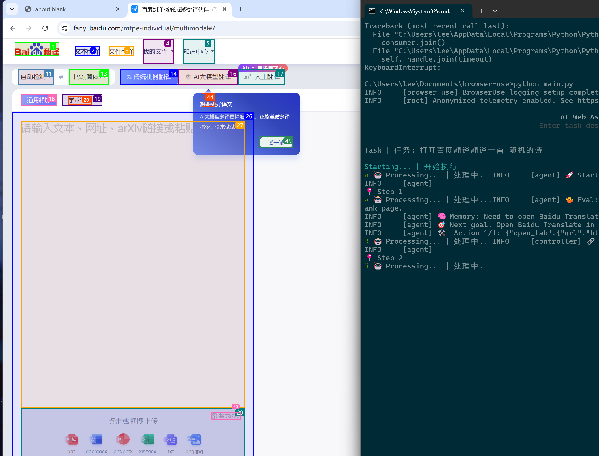

# Browser-Use

[中文文档](README_cn.md) | English

A Playwright-based browser automation tool with seamless integration for OpenAI and Anthropic AI models.

## Requirements

- Python 3.11 or higher

## Quick Start

### Installation

1. Install via pip:

```bash
pip install browser-use
```

2. Install dependencies:

```bash
pip install -r requirements.txt
```

3. Install Playwright (optional):

```bash
playwright install
```

### Environment Setup

1. Copy the environment variables template:

```bash
cp .env.example .env
```

2. Configure the following environment variables in your `.env` file:

- `OPENAI_API_KEY`: Your OpenAI API key
- `ANTHROPIC_API_KEY`: Your Anthropic API key (optional)
- `OPENAI_BASE_URL`: OpenAI API endpoint (defaults to official URL)
- `ANONYMIZED_TELEMETRY`: Enable/disable anonymous telemetry (defaults to true)
- `BROWSER_USE_LOGGING_LEVEL`: Set logging level (options: result | debug | info)

### Running

Execute the main program:

```bash
python main.py
```

## Examples

Explore the `examples` directory for various use cases:

- Multi-tab handling
- CAPTCHA processing
- File upload operations
- Custom system prompts
- Parallel agents
- And more...

## Key Features

- Browser automation with AI integration
- Support for multiple AI models
- Efficient tab management
- Customizable logging levels
- Anonymous telemetry for improvements
- Extensive example collection

## Important Notes

1. Securely manage your API keys and never commit them to version control
2. Add `.env` to your `.gitignore` file
3. Ensure all required environment variables are properly configured before use

## Contributing

Contributions are welcome! Please feel free to submit pull requests or open issues for bugs and feature requests.

## License

[License Information]

---

<div align="center">
  <b>Star ⭐ this repo if you find it useful!</b><br>
  thx  Browser-Use team
</div>

## Acknowledgments

thx [browser-use](https://github.com/browser-use/browser-use), an excellent browser automation framework.

## Screenshots


*Browser-use interface showing Baidu Translate with multimodal translation capabilities*

---

<div align="center">
  <b>If you find this project helpful, please consider giving it a ⭐!</b><br>
  ❤️ 
</div>
