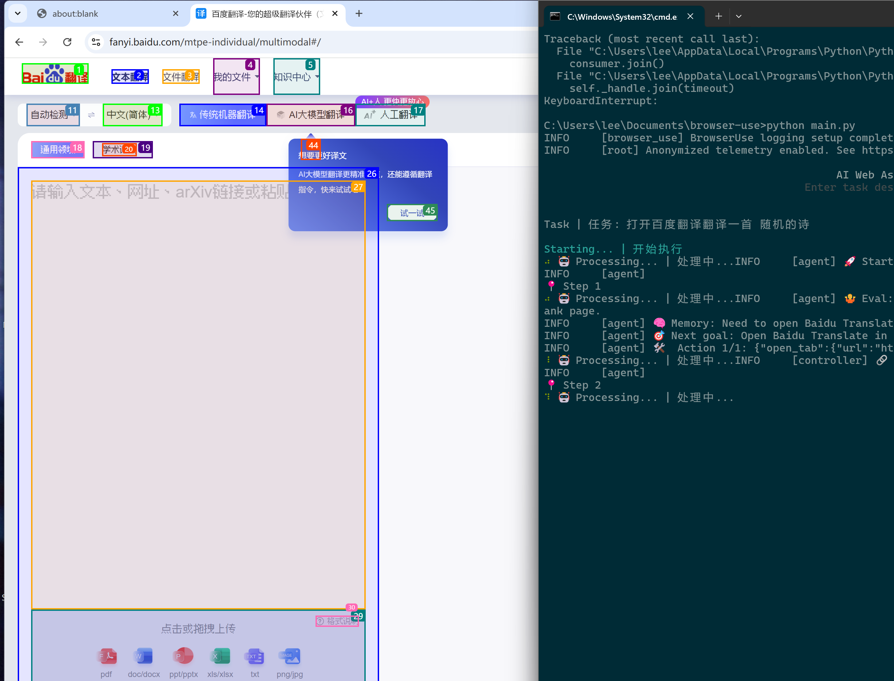

# Browser-Use

一个基于 Playwright 的浏览器自动化工具，支持与 OpenAI 和 Anthropic 的 AI 模型集成。

## 快速开始

### 安装

1. 使用 pip 安装包：

```bash
pip install browser-use
```

2. 安装 Playwright（可选）：

```bash
playwright install
```

### 环境配置

1. 复制环境变量示例文件：

```bash
cp .env.example .env
```

2. 编辑 `.env` 文件，设置以下必要的环境变量：

- `OPENAI_API_KEY`: OpenAI API密钥（二选一）
- `ANTHROPIC_API_KEY`: Anthropic API密钥（二选一）
- `OPENAI_BASE_URL`: OpenAI API地址（默认为官方地址）
- `ANONYMIZED_TELEMETRY`: 是否启用匿名遥测（默认为true）（可选）
- `BROWSER_USE_LOGGING_LEVEL`: 日志级别设置（可选：result | debug | info）（可选）

### 运行

运行主程序：

```bash
python main.py
```

## 示例

查看 `examples` 目录获取更多使用示例：

- 多标签页处理
- 验证码处理
- 文件上传
- 自定义系统提示
- 并行代理
- 等等...

## 注意事项

1. 请确保妥善保管您的API密钥，不要将其提交到版本控制系统中
2. 建议将 `.env` 文件添加到 `.gitignore` 中
3. 使用前请确保已正确配置所有必要的环境变量

## 致谢

 [browser-use](https://github.com/browser-use/browser-use) 

## 视频演示

您可以在Bilibili [Bilibili](https://www.bilibili.com/video/BV1s86tYtErS/) 查看项目演示视频。

## 截图展示


*Browser-use 运行界面展示，显示了百度翻译的多模态翻译功能*

---

<div align="center">
  <b>如果这个项目对您有帮助，欢迎点个 ⭐ 支持一下！</b><br>
  您的每个 star 都是对我们最大的鼓励 💪<br>

</div>

